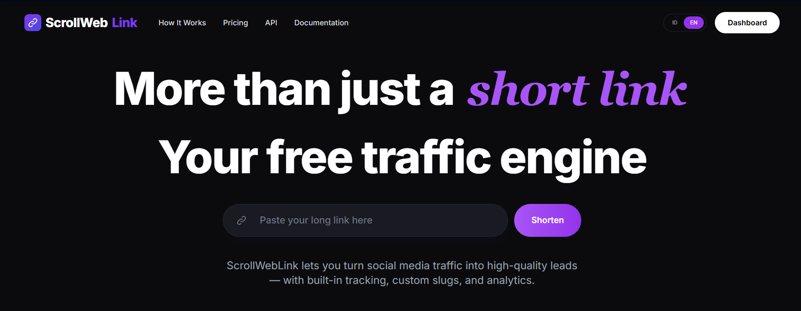
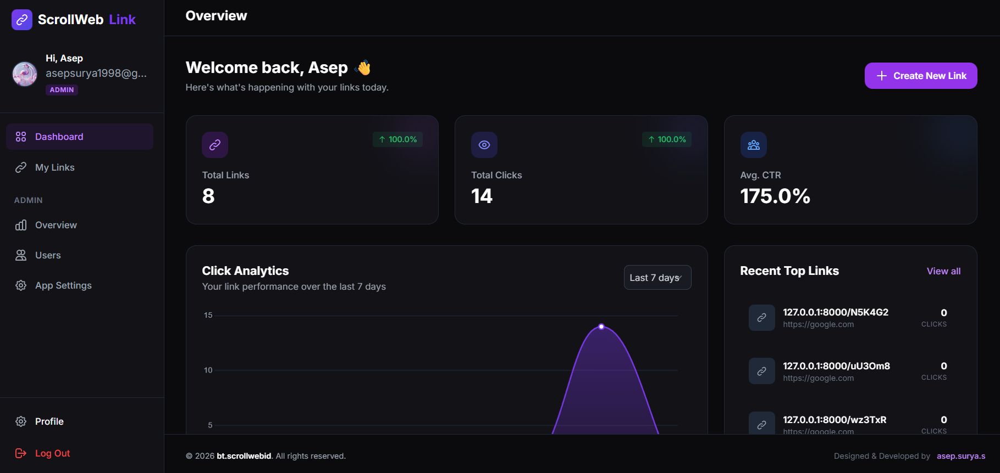
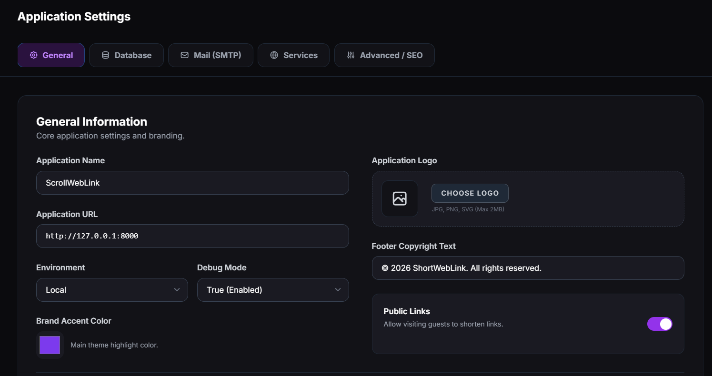

# ScrollWebLink - High Performance URL Shortener

A modern, fast, and feature-rich URL shortener built with Laravel, featuring a beautiful UI, detailed analytics, and an integrated admin settings dashboard.

## 🚀 Features
- **URL Shortening**: Generate compact URLs instantly with optional custom slugs.
- **Link Protection**: Secure sensitive URLs with passwords.
- **Expiration Dates**: Set links to auto-expire at a specific date and time.
- **Advanced Analytics**: Track clicks, device types, browsers, OS platforms, and referring URLs.
- **Bot Protection**: Guard public link generation forms with hCaptcha.
- **Social Login**: One-click registration and login via Google OAuth.
- **Admin Dashboard**: Control almost every aspect of your application directly from the web UI—no touching `.env` files required!
- **Redirect Screens**: Built-in 10-second countdown intermission screens (toggled by admins).

---

## 📸 Screenshots

Here is a glimpse of how the application looks and functions:

### 1. Welcome Page (Guest Link Creation)


### 2. User Dashboard (Analytics & Stats)


### 3. Admin App Settings (No .env touches required!)


---

## ⚙️ Requirements
- PHP 8.2 or higher
- Composer
- Node.js & NPM
- Database (MySQL, PostgreSQL, or SQLite)

---

## 🛠️ Installation Guide

Follow these steps to get the application running on your local machine or server.

### 1. Clone the repository
```bash
git clone https://github.com/asepsurya/short_link_apps.git
cd short_link_apps
```

### 2. Install PHP Dependencies
```bash
composer install
```

### 3. Install NPM Dependencies & Build Assets
```bash
npm install
npm run build
```

### 4. Setup Environment Parameters
Duplicate the `.env.example` template file to create your active `.env` config.
```bash
cp .env.example .env
```
*(If on Windows CMD, use `copy .env.example .env`)*

### 5. Generate Application Key
```bash
php artisan key:generate
```

### 6. Setup Database
Open `.env` in a text editor and update your database credentials:
```env
DB_CONNECTION=mysql
DB_HOST=127.0.0.1
DB_PORT=3306
DB_DATABASE=your_database_name
DB_USERNAME=your_database_user
DB_PASSWORD=your_database_password
```
*(Alternatively, simply set `DB_CONNECTION=sqlite` and create an empty file at `database/database.sqlite`)*

### 7. Run Migrations
Generate all required database tables:
```bash
php artisan migrate
```

### 8. Create your First Admin Account
Register a normal user account through the web interface. Afterwards, manually update the `role` column in your `users` database table from `'user'` to `'admin'`.

### 9. Start the Server
```bash
php artisan serve
```
Your app is now live at `http://localhost:8000`!

---

## 🔑 Configuration via Admin Panel

Once you have an Admin account, you no longer need to edit the `.env` file manually. Just navigate to **Admin Dashboard -> App Settings** to configure your database, mailer, AWS S3, and API keys visually! 

### How to get Google OAuth Credentials (Client ID & Secret)
To allow users to "Log In with Google":
1. Go to the [Google Cloud Console](https://console.cloud.google.com/).
2. Create a new project or select an existing one.
3. In the sidebar, navigate to **APIs & Services** > **Credentials**.
4. First, configure your **OAuth consent screen** if you haven't already.
5. Click **Create Credentials** at the top and select **OAuth client ID**.
6. Set the Application Type to **Web application**.
7. Name your OAuth client (e.g., "ScrollWebLink Login").
8. Under **Authorized redirect URIs**, add your application's exact callback URL:
   `https://yourdomain.com/auth/google/callback`
   *(Pro tip: You can copy this exact URL securely from your Admin Settings page).*
9. Click **Create**. Google will give you a **Client ID** and a **Client Secret**.
10. Go to your ScrollWebLink Admin App Settings, open the **Services** tab, paste these keys, and hit Save!

### How to get hCaptcha Keys (Bot Protection)
If you want to allow anonymous guests to shorten links, you need hCaptcha to prevent bot spam.
1. Create a free account at [hCaptcha.com](https://dashboard.hcaptcha.com/).
2. In your Dashboard, click **Add New Site** (or Sites -> New Site).
3. Enter your website hostname/domain.
4. Once created, you will see a **Sitekey** associated with your domain. Copy it.
5. Click on your profile icon (top right) -> **Settings**. Here you will find your **Secret Key**. Copy it.
6. Open your ScrollWebLink Admin App Settings, go to the **Services** tab, and enter both the Sitekey and Secret key.

---

## 👨‍💻 Author & Credits
- **Designed & Developed by**: `asep.surya.s`
- **Copyright** &copy; bt.scrollwebid

*Please retain the footer copyright notice to respect developer attribution.*
